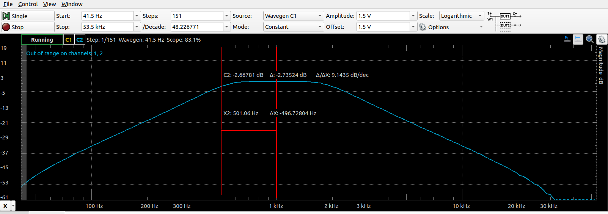
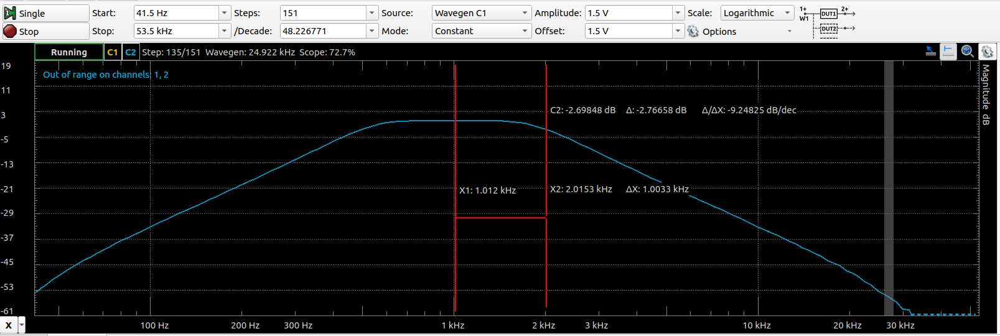
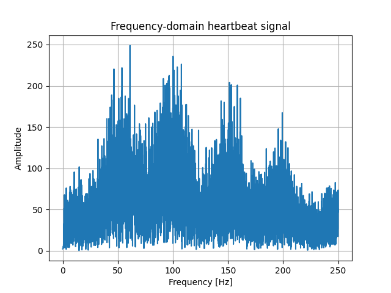
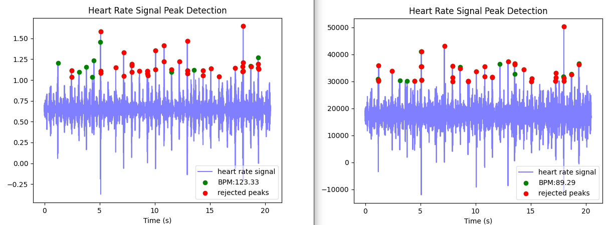
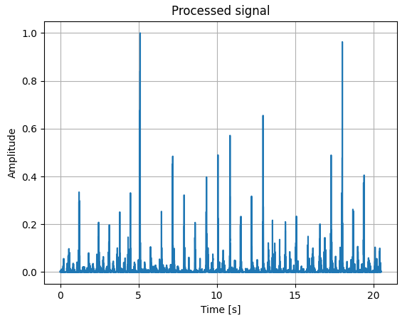
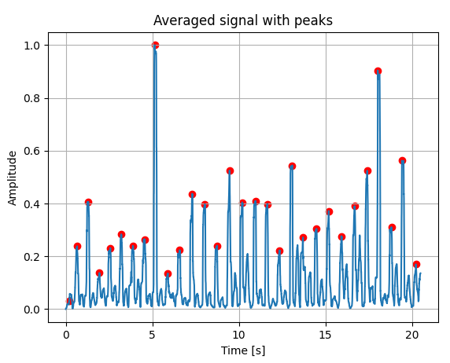
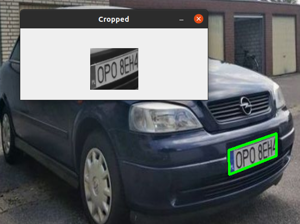
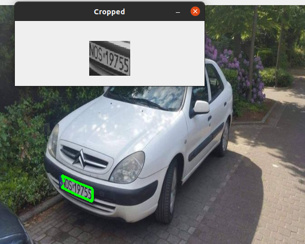
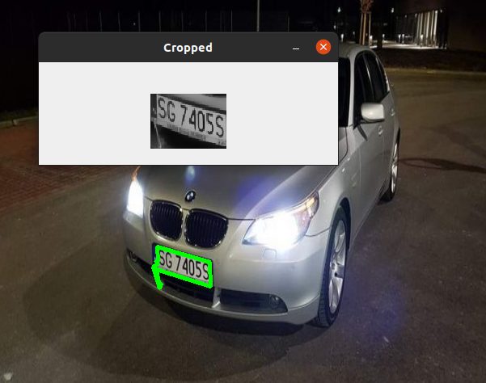

<!-- TABLE OF CONTENTS -->

## Table of contents
- [Digital Signal Processor (DSP) Architecture](#Digital-Signal-Processor--DSP--Architecture)
    - [Technology stack](#Technology-stack)
- [Laboratories 1 - warm-up](#Laboratories-1---warm---up)
- [Laboratories 2 - ADC](#Laboratories-2---ADC)
- [Laboratories 3 - DAC](#Laboratories-3---DAC)
- [Laboratories 4 - Modulations](#Laboratories-4---Modulations)
    - [Amplitude modulation AM](#amplitude-modulation-am)
    - [Frequency modulation FM](#frequency-modulation-fm)
- [Laboratories 5 - Filters](#Laboratories-5---Filters)
    - [Lowpass filter](#lowpass-filter)
    - [Bandpass filter](#bandpass-filter)
- [Laboratories 6 - Heartbeat signal processing](#Laboratories-6---Heartbeat-signal-processing)
    - [Pan-Tompkins algorithm](#pan---tompkins-algorithm)
- [Laboratories 7 - OpenCV](#laboratories-7---opencv)
    - [Face recognition](#face-recognition)
    - [Cars' license plates detection](#cars--license-plates-detection)
- [Laboratories 8 - Perceptron](#Laboratories-8---Perceptron)

### Face recognition

### Cars' license plates detection

(<a href="#readme-top">back to top</a>)

<!-- ------------------------------------------------- -->

## Digital Signal Processor (DSP) Architecture

The aim of these classes was to obtain knowledge related to digital signal processing, algorithms permformed on STM32, some computer vision issues and introduction to neural networks.

### Technology stack

During these classes the following tools have been used:
*   C
*   STM32
*   Python
*   OpenCV
*   TensorFlow

(<a href="#readme-top">back to top</a>)

<!-- ------------------------------------------------- -->

## Laboratories 1 - warm

The purpose of this classes was to get familiar with STM32CubeIDE and basics of HAL. That's why I will skip the details 

(<a href="#readme-top">back to top</a>)

<!-- ------------------------------------------------- -->

## Laboratories 2 - ADC

During these laboratories I had to measure the sine signal from external device - Analog Discovery 2 of Digilent. Those signal had to be generated with different frequency.

    

Then fast Fourier transform (FFT) had to be perfomed for those signals. The task was to observe the aliasing effect - when the signal's frequency is higher than the half of the sampling freqency

    

    

ADC was also performed for simple ADC and through the DMA module. Moreover DMA helped to perform oversampling which resulted in better Effective number of bits (ENOB):

    <table>
        <tr>
            <td>Simple ADC</td>
            <td>ADC with DMA and oversampling</td>
        </tr>
	    <tr>
    	    <td>
                
      	    </td>
            <td>
                 
            </td>
        </tr>
    </table>

(<a href="#readme-top">back to top</a>)

<!-- ------------------------------------------------- -->

## Laboratories 3 - DAC

In this exercise there was a need to generate sine wave from look-up table (LUT).

Moreover Direct digital synthesis (DDS) method has been implemented. Thanks to this it was possible to gneerate sine wave with any frequency (of course the higher frequency the more deformated sine wave is). For frequency f=1kHz:

For frequency f=10kHz:

(<a href="#readme-top">back to top</a>)

<!-- ------------------------------------------------- -->

## Laboratories 4 - Modulations

The aim of these classes was to implement amplitude modulation (AM) and frequency modulation (FM). Both modulation were easy to implement thanks to the DDS algorithm from previous classes. The main idea is to provide carrier wave which is modulated according to modulating wave.

### Amplitude modulation AM

For this case amplitude of carrier wave changes according to the values of modulating signal:

### Frequency modulation FM

In turn, in this case the only difference is that the frequency of carrier wave will be changed;

(<a href="#readme-top">back to top</a>)

<!-- ------------------------------------------------- -->

## Laboratories 5 - Filters

During this task I had to implement IIR filter, and more precisely lowpass and bandpass filter. IIR filter is base on feedback - historical input and output are taking part in final result.

    

### Lowpass filter

Lowpass filter has been implemented for frequency f=4kHz. The amplitude characteristics are as follows:

### Bandpass filter

This filter had to be implemented to work with $f_{1} = 500Hz$ and $f_{2} = 2kHz$:

    

    

(<a href="#readme-top">back to top</a>)

<!-- ------------------------------------------------- -->

## Laboratories 6 - Heartbeat signal processing

Input signal was a heartbeat signal of mother and her baby. The task was to fitler them and separate them (with the use of python). The FFT of this signal is as follows:

    

If we filter first, second and third harmonic we can obtain child heartbeat signal. Butterworth bandpass filter has been used. I also applied heartpy lib which was responsible for determining heart rate. On the left side we can see filtered signal and on the right side there is unfiltered signal:

    

### Pan-Tompkins algorithm

To verify the results Pan-Tompkins algorithm has been implemented and applied. This algorithm is very common used in ECG. To perform such method there is a need to do the following steps:
*   use bandpass filter
*   perform derivative of the signal
*   square the signal
    

        
    

*   apply moving window integrator
    

        
    

*   find peaks
    

        
    

(<a href="#readme-top">back to top</a>)

<!-- ------------------------------------------------- -->

## Laboratories 7 - OpenCV

This exercise consist of 2 tasks - implement code for:
*   face recognition
*   cars' license plates detection

During these tasks openCV has been used.

### Face recognition

To complete this task pretrained cascade classifier has been used - Haar feature-based cascade classifier:

    

The result of this classifier:

    

### Cars' license plates detection

This task was a little bit more difficult. Several image processing methods have to be performed. Original image:

    

*   gray out:
    

        
    

*   blurring:
    

        
    

*   apply Canny edge detector
    

        
    

Thanks to those edges there is a possibility to find contours:

    

For now we need to find closed contour with the highest area:

    <table>
	    <tr>
    	    <td>
                
      	    </td>
            <td>
                 
            </td>
            <td>
                 
            </td>
        </tr>
    </table>

(<a href="#readme-top">back to top</a>)

<!-- ------------------------------------------------- -->

## Laboratories 8 - Perceptron

(<a href="#readme-top">back to top</a>)

<!-- ------------------------------------------------- -->

