<!-- TABLE OF CONTENTS -->

## Table of contents
- [Digital Signal Processor (DSP) Architecture](#Digital-Signal-Processor--DSP--Architecture)
    - [Technology stack](#Technology-stack)
- [Laboratories 1 - warm-up](#Laboratories-1---warm---up)
- [Laboratories 2 - ADC](#Laboratories-2---ADC)
- [Laboratories 3 - DAC](#Laboratories-3---DAC)
- [Laboratories 4 - Modulations](#Laboratories-4---Modulations)
    - [Amplitude modulation AM](#amplitude-modulation-am)
    - [Frequency modulation FM](#frequency-modulation-fm)
- [Laboratories 5 - Filters](#Laboratories-5---Filters)
    - [Lowpass filter](#lowpass-filter)
    - [Bandpass filter](#bandpass-filter)
- [Laboratories 6 - Heartbeat signal processing](#Laboratories-6---Heartbeat-signal-processing)
    - [Pan-Tompkins algorithm](#pan---tompkins-algorithm)
- [Laboratories 7 - OpenCV](#laboratories-7---opencv)
    - [Face recognition](#face-recognition)
    - [Cars' license plates detection](#cars--license-plates-detection)
- [Laboratories 8 - Perceptron](#Laboratories-8---Perceptron)
- [Conclusions](#conclusions)

<!-- ------------------------------------------------- -->

## Digital Signal Processor (DSP) Architecture

The aim of these classes was to obtain knowledge related to digital signal processing, algorithms permformed on STM32, some computer vision issues and introduction to neural networks.

### Technology stack

During these classes the following tools have been used:
*   C
*   STM32
*   Python
*   OpenCV
*   TensorFlow

(<a href="#readme-top">back to top</a>)

<!-- ------------------------------------------------- -->

## Laboratories 1 - warm-up

The purpose of this classes was to get familiar with STM32CubeIDE and basics of HAL. That's why I will skip the details 

(<a href="#readme-top">back to top</a>)

<!-- ------------------------------------------------- -->

## Laboratories 2 - ADC

During these laboratories I had to measure the sine signal from external device - Analog Discovery 2 of Digilent. Those signal had to be generated with different frequency.

    

Then fast Fourier transform (FFT) had to be perfomed for those signals. The task was to observe the aliasing effect - when the signal's frequency is higher than the half of the sampling freqency

    

    

ADC was also performed for simple ADC and through the DMA module. Moreover DMA helped to perform oversampling which resulted in better Effective number of bits (ENOB):

    <table>
        <tr>
            <td>Simple ADC</td>
            <td>ADC with DMA and oversampling</td>
        </tr>
	    <tr>
    	    <td>
                
      	    </td>
            <td>
                 
            </td>
        </tr>
    </table>

(<a href="#readme-top">back to top</a>)

<!-- ------------------------------------------------- -->

## Laboratories 3 - DAC

In this exercise there was a need to generate sine wave from look-up table (LUT).

Moreover Direct digital synthesis (DDS) method has been implemented. Thanks to this it was possible to gneerate sine wave with any frequency (of course the higher frequency the more deformated sine wave is). For frequency f=1kHz:

For frequency f=10kHz:

(<a href="#readme-top">back to top</a>)

<!-- ------------------------------------------------- -->

## Laboratories 4 - Modulations

The aim of these classes was to implement amplitude modulation (AM) and frequency modulation (FM). Both modulation were easy to implement thanks to the DDS algorithm from previous classes. The main idea is to provide carrier wave which is modulated according to modulating wave.

### Amplitude modulation AM

For this case amplitude of carrier wave changes according to the values of modulating signal:

### Frequency modulation FM

In turn, in this case the only difference is that the frequency of carrier wave will be changed;

(<a href="#readme-top">back to top</a>)

<!-- ------------------------------------------------- -->

## Laboratories 5 - Filters

During this task I had to implement Infinite Impulse Response (IIR) filter, and more precisely lowpass and bandpass filter. IIR filter is base on feedback - historical input and output are taking part in final result.

    

### Lowpass filter

Lowpass filter has been implemented for frequency f=4kHz. The amplitude characteristics are as follows:

### Bandpass filter

This filter had to be implemented to work with $f_{1} = 500Hz$ and $f_{2} = 2kHz$:

    

    

(<a href="#readme-top">back to top</a>)

<!-- ------------------------------------------------- -->

## Laboratories 6 - Heartbeat signal processing

Input signal was a heartbeat signal of mother and her baby. The task was to fitler them and separate them (with the use of python). The FFT of this signal is as follows:

    

If we filter first, second and third harmonic we can obtain child heartbeat signal. Butterworth bandpass filter has been used. I also applied heartpy lib which was responsible for determining heart rate. On the left side we can see filtered signal and on the right side there is unfiltered signal:

    

### Pan-Tompkins algorithm

To verify the results Pan-Tompkins algorithm has been implemented and applied. This algorithm is very common used in ECG. To perform such method there is a need to do the following steps:
*   use bandpass filter
*   perform derivative of the signal
*   square the signal
    

        
    

*   apply moving window integrator
    

        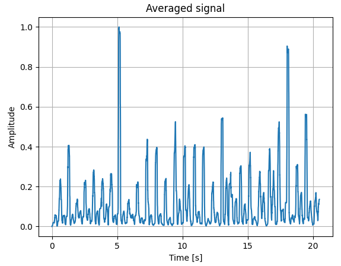
    

*   find peaks
    

        
    

(<a href="#readme-top">back to top</a>)

<!-- ------------------------------------------------- -->

## Laboratories 7 - OpenCV

This exercise consist of 2 tasks - implement code for:
*   face recognition
*   cars' license plates detection

During these tasks openCV has been used.

### Face recognition

To complete this task pretrained cascade classifier has been used - Haar feature-based cascade classifier:

    

The result of this classifier:

    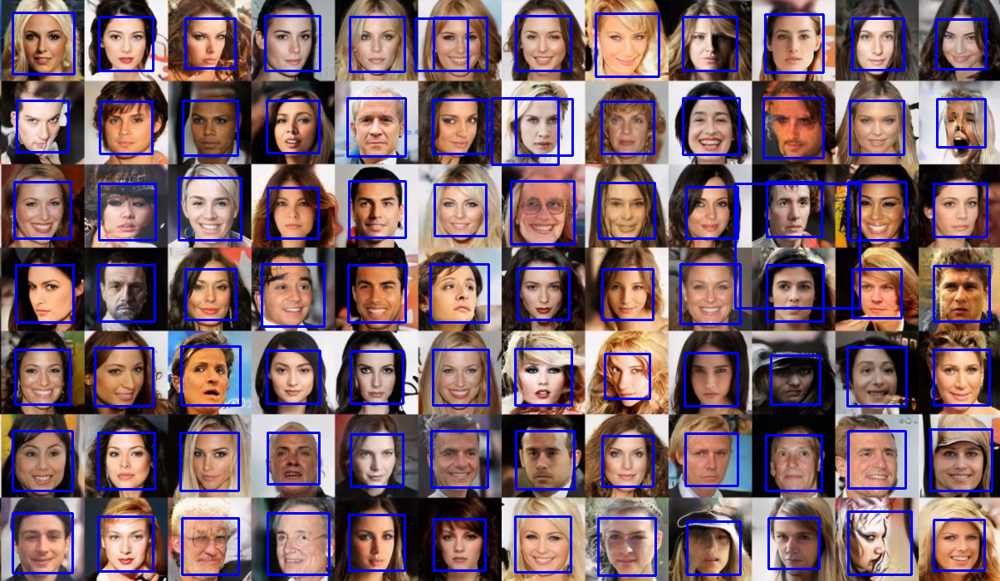

### Cars' license plates detection

This task was a little bit more difficult. Several image processing methods have to be performed. Original image:

    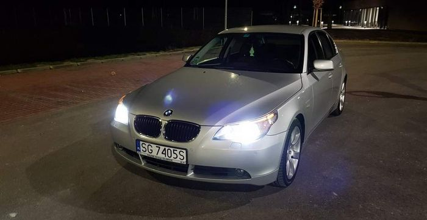

*   gray out:
    

        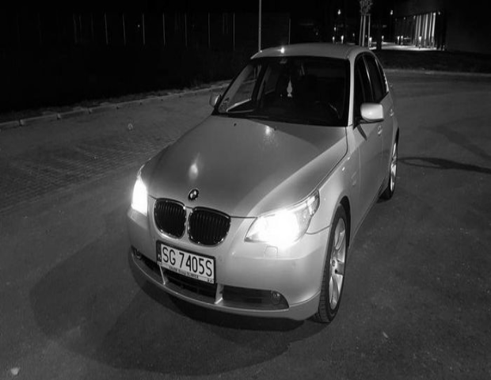
    

*   blurring:
    

        
    

*   apply Canny edge detector
    

        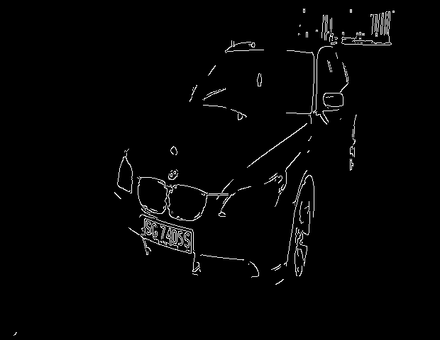
    

Thanks to those edges there is a possibility to find contours:

    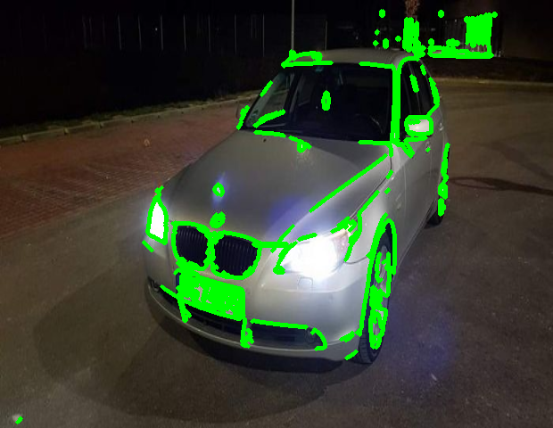

For now we need to find closed contour with the highest area:

    <table>
	    <tr>
    	    <td>
                
      	    </td>
            <td>
                 
            </td>
            <td>
                 
            </td>
        </tr>
    </table>

(<a href="#readme-top">back to top</a>)

<!-- ------------------------------------------------- -->

## Laboratories 8 - Perceptron

In this task there was a need to analyze the principle of operation of single perceptron. At first I had to implement 1-layer 1-neuron perceptron and use this model
to solve the problem of regression. Dataset have been initialized:

    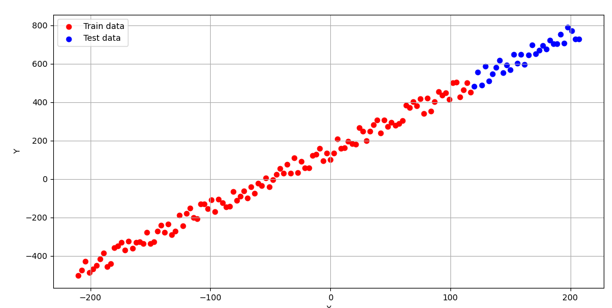

Then our perceptron has been implemented. It has one layer of one neuron
because it is sufficient for training linear function. Then I trained model on training data
for various parameters.
Two cases have been compared, where the first one checks Adam optimizer and the
second one SGD (Stochastic Gradient Descent) optimizer, both for mean absolute
error. Those cases have been checked for different learning rates. The findings are as
follows:

    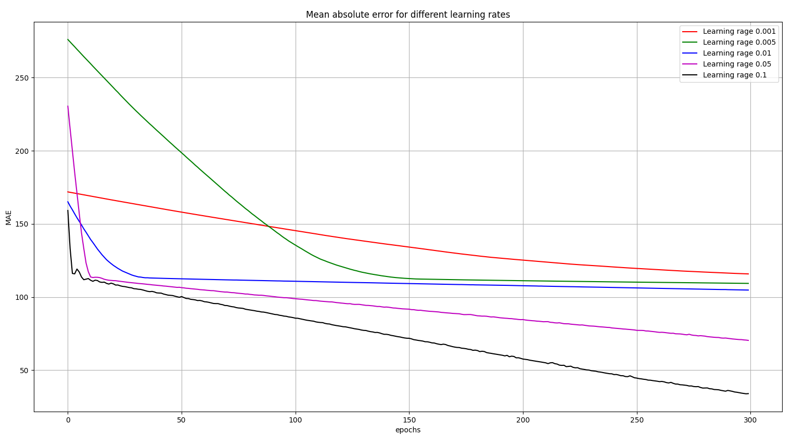

    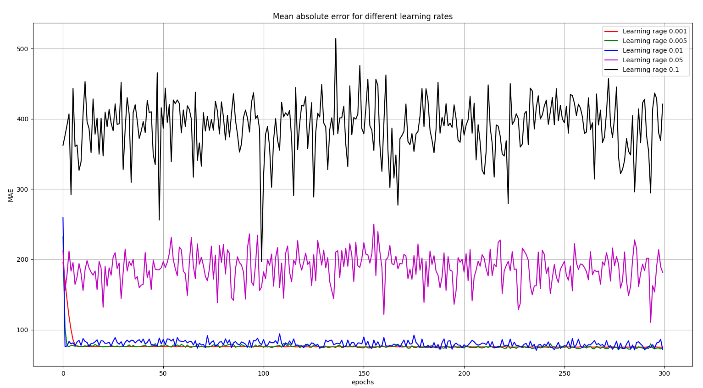

We can notice that both algorithms work inversely – Adam needs higher learning
rate to obtain better results while SGD seems to be destabilized for higher learning
rate.
I also checked both optimizers for mean square error as a loss function but I remain
mean absolute error as a metric just to be able to compare those methods. For SGD the results
are not even interpretable because I’ve optained error of $10^{32}$. For Adam case the plot
is as follows:

    

Adam optimizer seems to be the best choice for this kind of problem. Then I've checked the results with respect to the number of epochs:

    

As we can see for the best case (learning rate $lr=0.1$) 500 epochs are sufficient. The plot for the best case:

    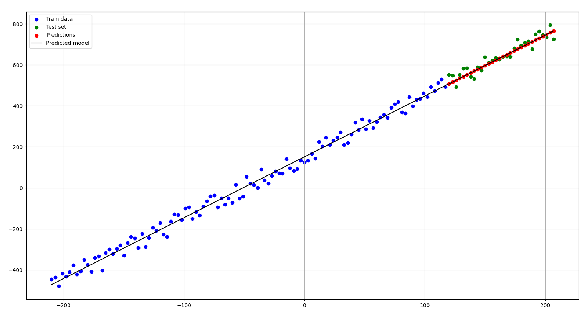

The weights of this neuron can be interpreted as a coefficients of linear function:
$$ y_{exact}  = 3*X + 100$$

$$ y_{pred}  = 2.98*X + 51.07$$

As we can see there is a huge difference for bias. Even if I provide additional
learning rate and more epochs the difference for bias will be still visible. But If we provide lower noise we can get more accurate bias due to the fact that standard deviation will be lower.

I also checked if it's possible to approximate square function

$$ {\left\lbrack \matrix{X^2 \cr X \cr 1} \right\rbrack} $$

The results are as follows:

    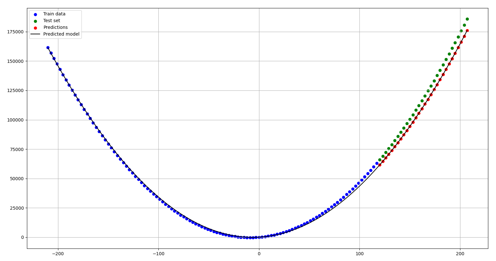

(<a href="#readme-top">back to top</a>)

<!-- ------------------------------------------------- -->

## Conclusions

During these classes I have obtained a large amount of knowledge of:

*   Analog-Digital and Digital-Analog converter, how to read and gerenate signal, how to generate sine wave with various frequency, oversampling, ENOB estimating,
*   AM & FM modulation, how to apply them,
*   IIR/FIR filters, how to implement them, structure of lowpass and bandpass filter,
*   Signal processing, heartbeat processing, signal separation, ECG methods (Pan-Tompkins algorithm),
*   OpenCV methods, object detection, object recognition, possible image processing transformations,
*   Structure of single perceptron, Adam and SGD optimizer, dependence of various parameters, "geometrical" interpretation of neuron weights.

(<a href="#readme-top">back to top</a>)

<!-- ------------------------------------------------- -->

