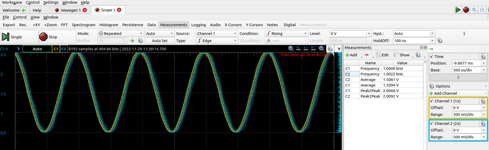

<!-- TABLE OF CONTENTS -->

## Table of contents
- [Digital Signal Processor (DSP) Architecture](#Digital-Signal-Processor--DSP--Architecture)
    - [Technology stack](#Technology-stack)
- [Laboratories 1 - warm-up](#Laboratories-1---warm---up)
- [Laboratories 2 - ADC](#Laboratories-2---ADC)
- [Laboratories 3 - DAC](#Laboratories-3---DAC)
- [Laboratories 4 - Modulations](#Laboratories-4---Modulations)
    - [Amplitude modulation AM](#amplitude-modulation-am)
    - [Frequency modulation FM](#frequency-modulation-fm)
- [Laboratories 5 - Filters](#Laboratories-5---Filters)
    - [Lowpass filter](#lowpass-filter)
    - [Bandpass filter](#bandpass-filter)
- [Laboratories 6 - Heartbeat signal processing](#Laboratories-6---Heartbeat-signal-processing)
- [Laboratories 7 - OpenCV face and cars' license plates detection](#laboratories-7---opencv-face-and-cars--license-plates-detection)
- [Laboratories 8 - Perceptron](#Laboratories-8---Perceptron)

<!-- ------------------------------------------------- -->

## Digital Signal Processor (DSP) Architecture

The aim of these classes was to obtain knowledge related to digital signal processing, algorithms permformed on STM32, some computer vision issues and introduction to neural networks.

### Technology stack

During these classes the following tools have been used:
*   C
*   STM32
*   Python
*   OpenCV
*   TensorFlow

<!-- ------------------------------------------------- -->

## Laboratories 1 - warm

The purpose of this classes was to get familiar with STM32CubeIDE and basics of HAL. That's why I will skip the details 

<!-- ------------------------------------------------- -->

## Laboratories 2 - ADC

During these laboratories I had to measure the sine signal from external device - Analog Discovery 2 of Digilent. Those signal had to be generated with different frequency.

Then fast Fourier transform (FFT) had to be perfomed for those signals. The task was to observe the aliasing effect - when the signal's frequency is higher than the half of the sampling freqency

    

    

ADC was also performed for simple ADC and through the DMA module. Moreover DMA helped to perform oversampling which resulted in better Effective number of bits (ENOB):

    <table>
        <tr>
            <td>Simple ADC</td>
            <td>ADC with DMA and oversampling</td>
        </tr>
	    <tr>
    	    <td>
                
      	    </td>
            <td>
                 
            </td>
        </tr>
    </table>

<!-- ------------------------------------------------- -->

## Laboratories 3 - DAC

In this exercise there was a need to generate sine wave from look-up table (LUT).

Moreover Direct digital synthesis (DDS) method has been implemented. Thanks to this it was possible to gneerate sine wave with any frequency (of course the higher frequency the more deformated sine wave is). For frequency f=1kHz:

For frequency f=10kHz:

<!-- ------------------------------------------------- -->

## Laboratories 4 - Modulations

The aim of these classes was to implement amplitude modulation (AM) and frequency modulation (FM). Both modulation were easy to implement thanks to the DDS algorithm from previous classes. The main idea is to provide carrier wave which is modulated according to modulating wave.

### Amplitude modulation AM

For this case amplitude of carrier wave changes according to the values of modulating signal:

### Frequency modulation FM

In turn, in this case the only difference is that the frequency of carrier wave will be changed;

<!-- ------------------------------------------------- -->

## Laboratories 5 - Filters

During this task I had to implement IIR filter, and more precisely lowpass and bandpass filter. IIR filter is base on feedback - historical input and output are taking part in final result.

    

### Lowpass filter

Lowpass filter has been implemented for frequency f=4kHz. The amplitude characteristics are as follows:

### Bandpass filter

<!-- ------------------------------------------------- -->

## Laboratories 6 - Heartbeat signal processing

<!-- ------------------------------------------------- -->

## Laboratories 7 - OpenCV face and cars' license plates detection

<!-- ------------------------------------------------- -->

## Laboratories 8 - Perceptron

<!-- ------------------------------------------------- -->

